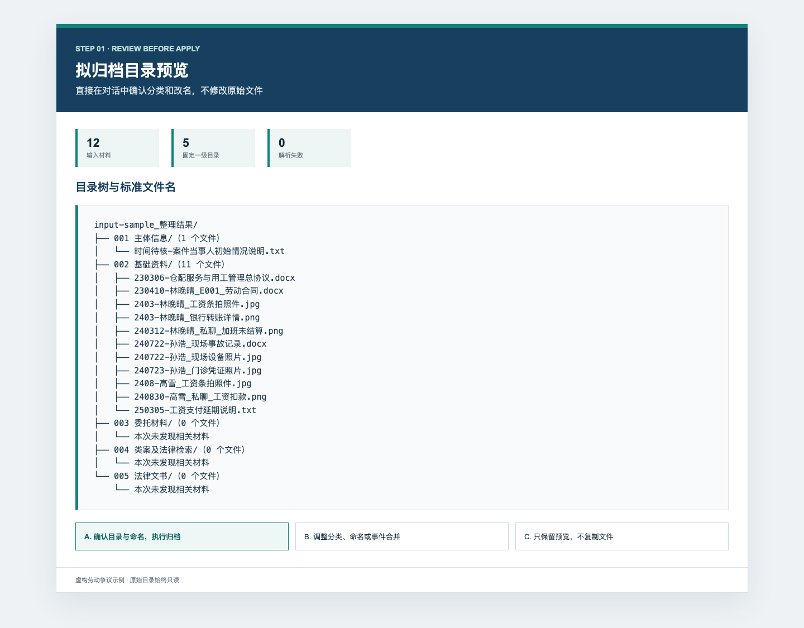
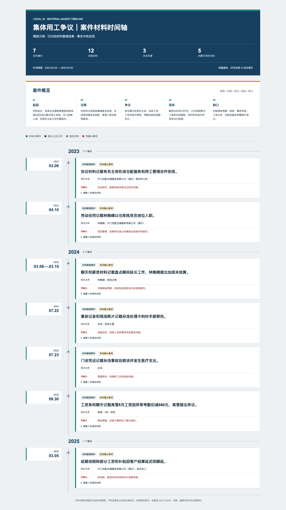

# LawyerBuddy

LawyerBuddy 是面向律师的模块化法律工作助手。一次安装即可获得一个总路由、六个产品 Skill，以及 38 个内部中文法律能力。

律师只需要调用 `@lawyerbuddy` 或某个产品 Skill。总路由根据任务按需读取底层能力，不会一次加载全部提示词。

## 六个产品入口

| 使用场景 | Skill | 当前能力 |
|---|---|---|
| 散乱案件材料分类归档 | `lawyerbuddy-sorting` | 清点、录音逐字稿检查、案由确认、分类、改名和归档 |
| 案件总结 | `lawyerbuddy-summarizing` | 生成案件主体、案件总结、关键时间轴表格和文件清单 |
| 关键时间轴 | `lawyerbuddy-timeline` | 生成专业 HTML 时间轴，按需导出 PNG/PDF |
| 类案检索 | `lawyerbuddy-similar-case-retrieval` | 争点提取、检索式、真实案例检索、类比和趋势归纳 |
| 法律文书起草 | `lawyerbuddy-document-drafting` | 起诉状、答辩状、代理词、律师函、法律意见书等律师审阅稿 |
| 合同审查 | `lawyerbuddy-contract-review` | 条款、履约、监管和交易风险审查及修改建议 |

`lawyerbuddy` 是总入口。复杂任务会按顺序组合产品 Skill，例如“整理材料、检索类案并起草诉状”会依次进入材料整理、类案检索和文书起草。

## Workbuddy 直接导入

仓库根目录已经包含符合 Agent Skill 规范的 `SKILL.md`。Workbuddy 可以直接导入 GitHub 仓库文件夹，也可以下载 Release Assets 中的 ZIP：解压后，第一层必须直接看到 `SKILL.md`，不要再套一层同名文件夹。

```text
lawyerbuddy-workbuddy-v1.7.3.zip
└── SKILL.md
```

导入后直接对 Workbuddy 说：

```text
请使用 LawyerBuddy Skill。我要整理这个案件材料文件夹：
/你的案件材料绝对路径
先展示案由候选、目录树和改名预览，未经我确认不要复制或改动原文件。
```

根 `SKILL.md` 只负责总路由；案件材料整理、案件总结和可视化时间轴等详细规则分别位于 `skills/` 子目录。ZIP 适合 Workbuddy 直接导入，GitHub 仓库仍适合 npx 安装和版本更新。

面向律师的导入步骤和可复制提示词见[《LawyerBuddy 使用指南》](./docs/使用指南.md)，包含案件材料整理、初稿确认和文书起草流程。

SkillHub 上传请使用专用精简包，不要直接上传整个开发仓库（其中可能含本地 Python 环境和平台不支持的 Excel 文件）。在仓库根目录运行 `npm run pack:skillhub`，再上传 `dist/lawyerbuddy-skillhub-v1.7.3/` 文件夹或同名 ZIP。打包器会排除 Excel、Python 字节码、测试、本地环境及平台不接受的文件，检查根目录 `SKILL.md` 元数据、文件类型，并确保文件数不超过 200。内置案由表已转换为 JSON，不会因平台禁止 Excel 而失效。

## 案件材料整理流程

材料整理工作流可以把用户提供的散乱案件文件夹整理成可确认、可追溯、可视化的标准案件目录。

它会读取文档与图片、统一主体、识别重复件、合并事件、提出待核问题；在用户确认目录树后，再复制、分类和规范命名。原始文件始终保持只读。

Skill 内置 2025 版民事案件案由参考表。它会先根据诉争法律关系、主要诉求和排除边界提出案由候选，优先选择有材料支持的四级案由；没有适用的四级案由时，再依次回退到三级、二级和一级案由。案由经用户确认后，统一用于项目目录、Word 报告和可视化时间轴标题。

默认先快速生成一份可讨论的初步案件报告和可视化时间轴，再按律师指定的金额、付款、主体、合同关系或具体材料继续核对；只有明确要求时才进行全量复核。系统术语与机器数据只留在技术资料中。

```text
散乱材料文件夹
  → 清点文件并检查录音逐字稿
  → 缺少逐字稿时等待用户补充
  → 案件初筛并确认最具体案由
  → 确认默认 001—005 或自定义目录
  → 按用户选择的深度读取关键材料
  → 主体统一 / 重复与版本识别
  → 多份材料合并为事件
  → Markdown 目录树与改名确认
  → 002 基础资料按内容自动细分
  → 分类、复制和改名
  → 整理结果（Word 案件梳理报告 / 独立可视化时间轴）
```

## 什么时候使用

当一个案件文件夹里同时存在合同、聊天截图、银行流水、工资表、扫描件等材料，而且文件名、日期和目录比较散乱时，可以使用本 Skill。它适合在能够访问本地项目文件的代码级 Agent 中运行，例如 Codex、Claude Code、WorkBuddy，以及其他支持 Agent Skills 或本地工作区的工具。

普通网页聊天如果不能访问电脑上的完整文件夹，就无法直接完成分类和复制。请先在所用 Agent 中打开项目目录，或者通过该平台的“添加文件夹”“Open Folder”“Add Folder to Workspace”等功能，把案件材料文件夹加入当前工作区。

## 三步开始使用

### 1. 安装

需要 Node.js 18 及以上版本和 Git。可以把下面整段直接发给 Codex、Claude Code、WorkBuddy 等本地 Agent：

```text
请按照以下说明安装 LawyerBuddy：
https://github.com/bseazh/lawyerbuddy/blob/v1.7.1/INSTALL.md

请在当前项目目录完成安装和环境检查。远程下载最多等待 5 分钟，不要自动安装大体积可选组件：
npx --yes github:bseazh/lawyerbuddy#v1.7.1 install
node .agents/skills/lawyerbuddy/scripts/doctor.js doctor
```

也可以直接在项目目录运行：

```bash
npx --yes github:bseazh/lawyerbuddy#v1.7.1 install
node .agents/skills/lawyerbuddy/scripts/doctor.js doctor
```

### 2. 复制案件文件夹路径

- macOS：在 Finder 选中文件夹，按 `Option + Command + C`。
- Windows：按住 `Shift` 右键文件夹，选择“复制为路径”；也可以用 `Alt + D` 复制地址栏。
- 支持添加文件夹的 Agent，也可以直接使用“Open Folder”或“Add Folder to Workspace”。

### 3. 复制下面的话开始整理

将其中的示例路径替换为案件材料文件夹的绝对路径：

```text
@lawyerbuddy

请整理这个案件材料文件夹：
/Users/你的名字/Documents/案件材料

先只读取和分析，展示案由候选、拟分类目录树、改名结果和待确认事项。未经我确认，不要复制、移动、覆盖或删除原文件。
```

Windows 用户只需把路径改成：

```text
C:\Users\你的名字\Documents\案件材料
```

没有 `@` 功能时，把第一行改为“请使用 lawyerbuddy Skill”。其他功能也可以直接调用：

```text
@lawyerbuddy-similar-case-retrieval 请围绕本案争议焦点检索类案。
@lawyerbuddy-document-drafting 请根据已确认事实起草民事起诉状。
@lawyerbuddy-contract-review 请站在乙方立场审查这份合同。
```

完成录音逐字稿检查后，Agent 会先根据内置参考表提出主要案由和其他候选案由，并展示案由层级、判断依据与排除理由。确认主要案由后，再选择目录方案。默认目录会完整展开，不会只显示“001—005”：

```text
A. 使用默认目录

001 主体信息/
002 基础资料/
003 委托材料/
004 类案及法律检索/
005 法律文书/

B. 自定义一级、二级目录

一级目录1：
- 二级目录：
- 二级目录：

一级目录2：
- 二级目录：
- 二级目录：
```

选择 A 后，`002 基础资料`会根据案件内容自动提出二级目录，并在归档前展示完整目录树。选择 B 时，可以直接填写一、二级目录；也可以只填写一级目录，由 Agent 提出二级目录后再次确认。

例如，用户回复 `A. 使用上述默认目录` 后，Agent 不会立即移动文件，而会继续通读材料并给出类似下面的预览。以下名称仅为虚构示例；`002 基础资料` 的二级目录根据本案材料生成，不是固定模板：

```text
1-星河电子VS启明科技-买卖合同纠纷/
├── 001 主体信息/
│   └── 160512-启明科技设立登记档案.pdf
├── 002 基础资料/
│   ├── 01 合同协议/
│   │   └── 220218-星河电子与启明科技采购合同-拍摄件01.jpg
│   ├── 02 付款凭证/
│   │   └── 220218-星河电子支付货款90000元.jpg
│   ├── 03 质量检测报告/
│   ├── 04 原厂标准/
│   └── 05 往来沟通与录音/
├── 003 委托材料/
├── 004 类案及法律检索/
└── 005 法律文书/
```

目录树之后会列出每份材料的“原文件名、改名后文件名、目标目录”，并让用户进行第二次确认：

```text
A. 确认目录与命名，执行归档
B. 调整分类、命名或事件合并方案
C. 只保留预览，不复制文件
```

只有再次选择 A，Skill 才会把材料复制到规范案件目录。选择 B 可以用自然语言说明需要调整的目录或文件名；选择 C 则保留预览，原材料不发生变化。

如果发现录音，Agent 会先检查逐字稿；缺少逐字稿时暂停案件分析，并在回复中直接给出 [阿里云听悟](https://tingwu.aliyun.com/home) 链接和缺失清单。存在同日期或同主题的候选逐字稿时，Agent 会先列出对应关系请用户确认，不会自行认定。缺少逐字稿不影响快速归档录音原件，但补齐或确认后才能形成案件主线、报告和时间轴。

### 先出初稿，再按问题补强

目录确认后不会自动逐页阅读全部材料。默认先核对关键材料，快速产出一份初步 Word 报告和可视化时间轴：

```text
A. 生成快速初稿（推荐）
B. 按指定问题专项核对
C. 全量复核
D. 只做快速归档
```

快速初稿优先核对合同、付款、法律文书、检测鉴定、逐字稿和关键沟通等关键材料；普通材料先登记并批量提取，出现冲突、新金额、新主体或关键事件时再升级阅读。初稿至少包含案件主体、案件概况、主要争议和一项有来源的关键事件，未核对内容统一放入“待确认事项”。只有用户明确要求“全量复核”时，才执行全部材料的三轮阅读。

初稿生成后直接选择下一步：

```text
A. 先打开报告和时间轴
B. 补充核对金额与付款情况
C. 补充核对主体与合同关系
D. 补充核对指定材料
```

三个产品 Skill 通过同一份 `归档方案_已执行.json` 交接进度。推荐顺序是：

```text
lawyerbuddy-sorting
  → lawyerbuddy-summarizing
  → lawyerbuddy-timeline
```

选择“生成快速初稿”并确认归档预览后，Skill 会连续完成归档、Word 报告和 HTML 时间轴，不在中间重复提问；选择“只做快速归档”则不会自动运行后续分析。即使换一个新会话，也可以把案件根目录交给 `@lawyerbuddy`，它会根据交接状态继续推荐下一步。

### 全量复核门禁

全量复核模式下，Skill 会执行三轮复核：逐份完整提取、跨材料核对、法律事实复核，并从明细重新计算：

```text
材料覆盖率 = 已完整读取材料 / 全部材料
阅读单元覆盖率 = 已读页、工作表、图片或分段 / 应读总数
事实处置率 = 已进入报告、时间轴、背景或待确认清单的事实 / 全部提取事实
```

三项均达到 100% 才能声明完成全量复核。快速初稿和专项核对不要求无关材料逐页达到 100%，也不会自动全量重扫；但报告中的每项事实必须来自已核对材料并有原文定位。延后核对或识别不清的内容会列入待确认事项。

Skill 不会生成空报告或空时间轴。案件主体、案件概况、主要争议或主线事件缺失时，只补充核对对应缺项；仍无法补齐时列出具体缺口并停止生成。只有全量复核模式允许自动进行一次全量补充扫描。可视化时间轴只能在 Word 报告成功后生成，并复用报告中同一组主线事件。

旧版本形成的案件如缺少阅读覆盖和事实台账，更新报告时必须回到原材料补做核验；不得自动把旧摘要标记为完整。

整理结果的最外层文件夹统一命名为：

```text
序号-原告简称VS被告简称-案由
```

例如：`1-张三VS李四-买卖合同纠纷`。主要案由、序号和双方简称会在复制归档前让用户确认。清点阶段的机器文件只保存在系统临时目录，不会在原材料旁生成“某某_工作区”；正式结果只使用上述规范案件名称。完成后，Agent 会确认结果目录真实存在，在 macOS 访达或 Windows 文件资源管理器中定位该文件夹，并在回复中裸露、单独成行显示案件根文件夹的完整绝对路径。用户不需要自己查找整理结果。

## 效果预览

### 先确认目录与改名，再执行归档



### 生成面向律师的案件梳理报告

案件报告固定包含案件主体、案件总结、关键时间轴表格和文件清单。

### 输出清晰的 HTML 时间轴



[查看完整的 12 份材料精简劳动争议示例](./examples/demo-labor-dispute/README.md)

## 安装与环境说明

完整的安装前审查、超时重试、代理和换源规则见 [INSTALL.md](./INSTALL.md)。Skill 尚未安装时，应让 Agent 先读取该文件；安装后遇到问题则读取 Skill 内的 `references/installation.md`。

在需要使用 Skill 的项目目录中运行：

```bash
npx --yes github:bseazh/lawyerbuddy#v1.7.1 install
```

安装到指定项目：

```bash
npx --yes github:bseazh/lawyerbuddy#v1.7.1 install --target /path/to/project
```

锁定版本：

```bash
npx --yes github:bseazh/lawyerbuddy#v1.7.1 install
```

安装位置：

```text
.agents/skills/lawyerbuddy/           # 总路由
.agents/skills/lawyerbuddy-sorting/   # 完整案件材料整理能力
.agents/lawyerbuddy/                  # 共享运行层
```

首次使用先运行 `doctor`。它会同时检查核心依赖和内置案由参考表是否完整，不会自动下载或修改系统：

```bash
node .agents/skills/lawyerbuddy/scripts/doctor.js doctor
```

完整的 Python 依赖只有 `openpyxl`、`python-docx` 和 `Pillow`。其中 `python-docx` 用于生成 Word 报告，另外两个用于读取表格和图片材料。为避免系统 Python 权限、版本或包冲突，建议在已安装 Skill 的项目目录中使用独立环境：

```bash
python3 -m venv .lawyerbuddy-env
.lawyerbuddy-env/bin/python -m pip install -i https://pypi.tuna.tsinghua.edu.cn/simple -r .agents/skills/lawyerbuddy-sorting/requirements.txt
```

Windows PowerShell 使用：

```bash
py -3 -m venv .lawyerbuddy-env
.\.lawyerbuddy-env\Scripts\python.exe -m pip install -i https://pypi.tuna.tsinghua.edu.cn/simple -r .agents\skills\lawyerbuddy-sorting\requirements.txt
```

中国大陆网络默认使用清华 PyPI 镜像；清华不可用时将地址换成中科大 `https://pypi.mirrors.ustc.edu.cn/simple`。每个镜像最多尝试一次，不关闭 TLS 校验，也不添加 `--trusted-host`。

Poppler、Tesseract 中文语言包和浏览器不属于首次安装项。只处理 Word、Excel、文本或已有文字稿时不需要它们；缺少时，相应图片或扫描件标记为“需人工查看”，其他材料继续整理。

只有任务需要提取 PDF 文字时，才使用中科大 Homebrew 镜像安装 Poppler：

```bash
HOMEBREW_NO_AUTO_UPDATE=1 HOMEBREW_API_DOMAIN=https://mirrors.ustc.edu.cn/homebrew-bottles/api HOMEBREW_BOTTLE_DOMAIN=https://mirrors.ustc.edu.cn/homebrew-bottles brew install poppler
```

只有任务需要识别图片、聊天截图或扫描 PDF 时，才补齐 OCR 组件：

```bash
HOMEBREW_NO_AUTO_UPDATE=1 HOMEBREW_API_DOMAIN=https://mirrors.ustc.edu.cn/homebrew-bottles/api HOMEBREW_BOTTLE_DOMAIN=https://mirrors.ustc.edu.cn/homebrew-bottles brew install poppler tesseract tesseract-lang
```

清华 Homebrew 备用镜像为 `https://mirrors.tuna.tsinghua.edu.cn/homebrew-bottles`，API 地址在末尾加 `/api`。镜像是官方 bottle 的国内同步副本，Homebrew 仍会执行 SHA256 校验，不需要直接访问 `ghcr.io`。

`doctor` 会根据电脑实际可用的 `python3`、`python` 或 Windows `py -3` 输出对应命令。如果是在仓库源码目录开发，把依赖路径改为 `skills/lawyerbuddy-sorting/requirements.txt`。

安装完成后再次运行 `doctor`；它会优先检查项目中的 `.lawyerbuddy-env`。后续整理脚本也必须使用这个项目环境，避免出现“已经安装但仍提示缺少”。

三个核心 Python 包通常只占几十 MB，具体取决于系统、Python 版本和缓存。Windows 和 Linux 用户也可以先完成普通材料整理，需要 OCR/PDF 深度解析时再按 `doctor` 提示安装对应系统组件。

查看产品 Skill 和内部法律能力：

```bash
npx --yes github:bseazh/lawyerbuddy#v1.7.1 list
npx --yes github:bseazh/lawyerbuddy#v1.7.1 capabilities
```

## 38 个内部法律能力

内部能力来自 `Legal-Skills-Chinese-main`，覆盖以下七组：

| 能力组 | 数量 | 示例 |
|---|---:|---|
| 信息检索 | 5 | 案例检索、法条检索、规范效力检查 |
| 事实与要素处理 | 4 | 法律要素提取、争议焦点、证据效力 |
| 法律解释 | 4 | 法律解释论证、体系解释、目的解释 |
| 法律推理 | 7 | 演绎、归纳、类比、溯因、反事实、冲突解决 |
| 论证组织与评估 | 4 | 论证链、证据链、论证强度、风险排序 |
| 风险评估与价值判断 | 6 | 合同履约、合规、监管、司法与行政价值判断 |
| 文书与事务管理 | 8 | 文书格式、摘要、术语、案件规划、期限和预算 |

这些能力安装在 `.agents/lawyerbuddy/capabilities/`，不会作为 38 个顶层 Skill 同时触发。路由索引、中文别名和产品调用链分别位于：

```text
.agents/lawyerbuddy/routing/capability-index.json
.agents/lawyerbuddy/routing/aliases.json
.agents/lawyerbuddy/routing/pipelines.json
```

每个阶段最多读取三个底层能力。需要引用法条或案例时必须调用真实检索工具；无法检索时只提供检索式，并将具体依据标记为“待检索”。

## 核心能力

- 读取 PDF、DOCX、XLSX、图片、TXT、CSV、JSON 等材料；
- 使用内置民事案件案由参考表提出候选，按四级、三级、二级、一级顺序选择最具体案由并交由用户确认；
- 读取图片和扫描 PDF 中的文字，并标记需要核对原件的内容；
- 区分事件发生时间、材料形成时间和文件修改时间；
- 建立主体标准名称、别名、角色和来源材料映射；
- 识别完全重复、疑似重复、格式副本和独立版本；
- 将多份证据合并到同一事件，避免“一份证据等于一条时间轴”；
- 对关键材料建立来源定位；全量复核时再对全部页面、工作表、图片和长文分段建立阅读覆盖台账；
- 按用户选择的深度处理材料；初稿中的事实均可回到已核对材料；全量复核时三项覆盖率达到 100%；
- 为每项实质事实记录来源、最终去向和法律要素对应，防止摘要压缩造成事实遗漏；
- 区分案件主线与主体历史背景，避免工商沿革挤占主时间轴；
- 可选择默认 `001` 至 `005` 五个材料目录，或使用自定义材料目录；成果统一放入 `整理结果`；
- 默认模式会根据材料内容自动细分 `002 基础资料`，例如合同协议、付款凭证、履约交付、质量检测报告和往来沟通；
- 归档前后生成 Markdown 目录树，并在对话中直接展示；
- 发现录音时先检查逐字稿；缺少逐字稿则暂停案件分析，不安装 Whisper；
- 以逐字稿形成候选主线，再用全部书面材料印证、纠偏和查漏；
- 生成 `整理结果/{确认案由}案件梳理报告.docx`；
- 根据同一组最终事件生成确定性 HTML 时间轴；PNG/PDF 按需导出。

## 律师成果

`{确认案由}案件梳理报告.docx` 固定包含案件主体、案件总结、关键时间轴表格和文件清单。独立时间轴文件名及页面标题也使用同一个确认案由；PNG/PDF 只在用户明确要求时导出。两份成果使用同一组最终事件，不显示内部编号、SHA-256、重复组、版本组、原文定位或机器路径。

音频和视频不由本 Skill 播放或转写。发现录音但缺少逐字稿时，Skill 会暂停案件分析并提供阿里云听悟链接；逐字稿补齐后才继续。逐字稿用于串联候选主线，但其日期、主体、金额和事件仍需与其他材料交叉核对。

## 确认与交付

第一次发生在复制文件之前：

```text
A. 确认目录与命名，执行归档
B. 调整分类、命名或事件合并方案
C. 只保留预览，不复制文件
```

归档、报告和时间轴完成后提供：

```text
A. 打开整理好的案件文件夹
B. 打开案件梳理报告
C. 打开独立可视化时间轴
```

同时必须显示经过确认的案件根文件夹绝对路径。不得只给成果文件名、相对路径或技术资料路径；即使报告或时间轴生成失败，也要先让用户能够打开已经整理好的材料目录。

## 标准输出

```text
1-张三VS李四-买卖合同纠纷/
├── 001 主体信息/
├── 002 基础资料/
│   ├── 01 合同协议/
│   ├── 02 付款凭证/
│   ├── 03 履约交付/
│   ├── 04 质量检测报告/
│   └── index.md
├── 003 委托材料/
├── 004 类案及法律检索/
├── 005 法律文书/
└── 整理结果/
    ├── 买卖合同纠纷案件梳理报告.docx
    ├── 买卖合同纠纷案件关键时间轴.html
    └── 技术资料/
        ├── 归档结果目录.md
        └── 归档方案_已执行.json
```

`002` 的二级目录会根据具体案件材料变化，不会机械套用全部示例目录。空的一级分类目录仍会保留，并注明“本次未发现相关材料”。技术映射只保存在 `整理结果/技术资料`，不主动展示给律师。

## 安全边界

- 原材料文件夹只读，不删除、不覆盖、不直接改名；
- 未经用户确认，不复制归档或生成最终时间轴；
- 不补造日期、主体、金额、聊天内容或案件事实；
- 重复件和不同版本均保留，详细关系只写入技术资料；
- 时间轴中的每个事件必须能追溯到材料编号和原文位置；
- 冲突信息并列记录，不擅自选择对任何一方有利的版本。

## 仓库结构

```text
bin/                              npx 安装与环境检查命令
skills/lawyerbuddy/               总路由
skills/lawyerbuddy-sorting/       完整案件材料整理能力
skills/lawyerbuddy-*/             其他产品入口
runtime/                          共享数据契约与模块交接规则
  capabilities/                  38 个内部中文法律能力
  routing/                       能力索引、别名和产品调用链
manifests/skills.json             模块状态与依赖清单
examples/                         可直接浏览的虚构案例与截图
```

## 许可与说明

`runtime/capabilities/legal-skills-chinese/` 中的第三方能力保留上游署名和许可说明，详见该目录的 `UPSTREAM_README.md` 与 `NOTICE.md`。

所有法律分析、检索结果和文书均为供律师审阅的辅助草稿，不构成法律意见。不得编造法条、案例、案号或裁判要旨。
