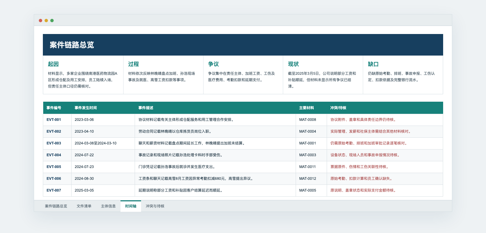

# 精简劳动争议示例

这是一个完全虚构的教学案例，用 12 份材料演示 `case-material-organizer` 的完整工作流。案例中的公司、人员、账号、金额和事件均不对应任何真实案件。

## 这个示例演示什么

```text
12 份散乱材料
    ↓ 内容读取、图片 OCR、日期和主体提取
4 个标准化主体 + 7 个主线事件 + 5 项待核问题
    ↓ 展示拟归档目录树，等待用户确认
001—005 分类、复制和规范命名
    ↓
简明案件概览 Excel + 文件索引 + 实际目录树
    ↓ 用户选择后生成
HTML 时间轴
```

重点不是材料数量，而是展示以下规则：

- 一份证据不直接等于一条事件；
- 聊天、工资条和转账记录可共同关联到同一加班事件；
- 事故发生与后续门诊属于不同事件；
- 文件名中的日期不能取代材料内容中的事件时间；
- 分类和改名必须先通过 Markdown 目录树让用户确认；
- 原始文件保持只读，整理结果以副本形式生成。

## 示例目录

```text
demo-labor-dispute/
├── input-sample/                 # 12 份散乱命名的虚构输入材料
├── 1-林晚晴等VS沪江优配等-劳动争议/ # 确认后的实际归档结果
│   ├── 001 主体信息/
│   ├── 002 基础资料/
│   │   ├── 01 合同协议/
│   │   ├── 02 工资付款与扣款/
│   │   ├── 03 加班与沟通/
│   │   ├── 04 事故医疗与现场/
│   │   └── index.md
│   ├── 003 委托材料/
│   ├── 004 类案及法律检索/
│   ├── 005 法律文书/
│   └── 整理结果/
│       ├── 案件材料汇总.xlsx
│       ├── 案件材料时间轴.html
│       ├── 材料统计与目录.txt
│       └── 技术资料/
│           ├── 归档结果目录.md
│           └── 归档方案_已执行.json
├── screenshots/                  # README 展示图
└── 归档目录预览.md                # 执行前确认界面
```

## 直接查看

- [执行前目录树与改名预览](./归档目录预览.md)
- [执行后实际目录树](./1-林晚晴等VS沪江优配等-劳动争议/整理结果/技术资料/归档结果目录.md)
- [案件材料汇总 Excel](./1-林晚晴等VS沪江优配等-劳动争议/整理结果/案件材料汇总.xlsx)
- [交互式 HTML 时间轴](./1-林晚晴等VS沪江优配等-劳动争议/整理结果/案件材料时间轴.html)
- [简明材料统计与目录树](./1-林晚晴等VS沪江优配等-劳动争议/整理结果/材料统计与目录.txt)

## 三个关键界面

### 1. 归档前确认


### 2. Excel 案件概览与简明时间轴



### 3. HTML 时间轴


## 示例边界

这个目录用于展示输出形态，不应作为真实法律意见或事实认定。真实案件仍需回查原件，核验 OCR、主体、时间、金额和材料完整性。
